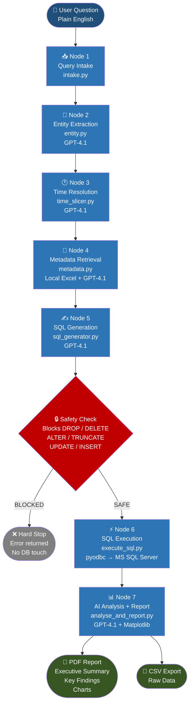

# 🤖 NL2SQL Analytics Agent

> **Ask a business question in plain English. Get data, analysis, and a PDF report — automatically.**

Built with **LangGraph · GPT-4.1 · MS SQL Server · Pandas · Matplotlib**

---

## 📌 Resume Bullets

- **Built an end-to-end Natural Language to SQL (NL2SQL) analytics agent** using LangGraph and GPT-4.1 that converts plain-English business questions into validated T-SQL queries, executes them against a production MS SQL Server database, and auto-generates a PDF business intelligence report with AI-written insights and dynamic charts — reducing ad-hoc data request turnaround from hours to seconds.

- **Designed a 7-node stateful LangGraph pipeline** with modular nodes for query intake, entity extraction, time resolution, metadata-driven table selection, SQL generation, safe DB execution (with a keyword-based write-operation guard blocking DROP/DELETE/ALTER/TRUNCATE), and GPT-powered analysis — achieving full separation of concerns with a shared typed state object passed across nodes.

- **Engineered an AI-driven metadata selection layer** that reads an Excel-based schema catalog, uses GPT-4.1 to identify the minimum required tables and columns, infers join criteria and filter conditions, and passes a structured context block to the SQL generation node — enabling accurate query generation across a complex multi-table insurance analytics database (PNL, FMIS, MasterLedger) without hardcoded table logic.

---

## 🏗️ Pipeline Architecture



---

## 📁 Project Structure

```
sql-analytics-agent/
│
├── main.py                        # Entry point — runs all 7 nodes in sequence
│
├── state/
│   └── state.py                   # Shared GraphState TypedDict passed across all nodes
│
├── nodes/
│   ├── intake.py                  # Node 1 — cleans and validates user query
│   ├── entity.py                  # Node 2 — extracts metrics, filters, dimensions via GPT
│   ├── time_slicer.py             # Node 3 — resolves MTD/YTD/last month etc. to dates
│   ├── metadata.py                # Node 4 — selects tables & columns from Excel schema
│   ├── sql_generator.py           # Node 5 — generates T-SQL via GPT
│   ├── execute_sql.py             # Node 6 — safety check + DB execution via pyodbc
│   └── analyse_and_report.py      # Node 7 — AI analysis + PDF + CSV output
│
├── utils/
│   └── local_loader.py            # Reads local Excel metadata file, manages cache
│
├── metadata.xlsx                  # Schema catalog — one sheet per DB table
├── metadata_cache.json            # Auto-generated cache (avoids re-reading Excel)
│
├── outputs/                       # Auto-created — all CSV and PDF outputs land here
│
├── requirements.txt               # All dependencies
└── .env                           # Credentials and config (never commit this)
```

---

## ⚙️ How It Works

### Step-by-step for the query: *"Give me MTD motor sales for today"*

| Node | What happens | Output |
|------|-------------|--------|
| **Intake** | Strips whitespace, assigns request ID and timestamp | `request_id`, `created_at` |
| **Entity Extraction** | GPT identifies metric, filter, agg | `entities{}` |
| **Time Resolution** | GPT converts MTD → `start: 2026-06-01`, `end: 2026-06-27` | `time_context{}` |
| **Metadata** | Reads Excel schema, GPT picks table, columns  | `selected_tables`, `metadata_context` |
| **SQL Generation** | GPT writes T-SQL with `WITH (NOLOCK)`, aliases, date range | `generated_sql` |
| **Safety Check** | Scans for DROP/DELETE/ALTER/TRUNCATE/UPDATE/INSERT — blocks if found | pass / block |
| **Execution** | Runs query via pyodbc, saves raw CSV | `result_data`, `csv_path` |
| **Analysis + Report** | GPT writes findings, matplotlib draws charts, PDF exported | `pdf_path`, `analysis_text` |

---

## 🔒 SQL Safety Guard

All write operations are blocked **before the DB connection is opened**:

```
Blocked keywords:  DROP  DELETE  ALTER  TRUNCATE
                   UPDATE  INSERT  MERGE  EXEC
                   EXECUTE  CREATE  REPLACE  RENAME
```

- Comments (`--` and `/* */`) are stripped first to prevent bypass
- Word-boundary matching prevents false positives (`DELETED_AT`, `DROPSHIP` are safe)
- `execution_status` is set to `"blocked"` — downstream analysis node is skipped

---

## 📊 Report Output

Every run produces two files in `outputs/`:

```
outputs/<request_id>_data.csv       ← full raw data
outputs/<request_id>_report.pdf     ← 4-page BI report
```

PDF pages:

| Page | Content |
|------|---------|
| 1 | Cover + Executive Summary |
| 2 | Key Findings · Trends · Implications · Recommendations |
| 3 | Data table (first 50 rows, styled) |
| 4+ | Auto-selected charts (line / bar / pie based on data shape) |

---

## 🚀 Setup

### 1. Clone and install

```bash
git clone https://github.com/yourusername/sql-analytics-agent.git
cd sql-analytics-agent
pip install -r requirements.txt
```

### 2. Install ODBC Driver (for MS SQL Server)

**Windows:** [Download ODBC Driver 17](https://learn.microsoft.com/en-us/sql/connect/odbc/download-odbc-driver-for-sql-server)

**Ubuntu:**
```bash
sudo ACCEPT_EULA=Y apt-get install -y msodbcsql17
```

**Mac:**
```bash
brew install unixodbc && brew install msodbcsql17
```

### 3. Configure `.env`

```bash
cp .env.example .env
```

```env
OPENAI_API_KEY        = sk-your-key-here
DB_DRIVER             = {ODBC Driver 17 for SQL Server}
DB_HOST               = your-server.rds.amazonaws.com
DB_NAME               = YourDatabase
DB_USER               = your_user
DB_PASSWORD           = your_password
METADATA_EXCEL_PATH   = metadata.xlsx
METADATA_CACHE_PATH   = metadata_cache.json
FORCE_REFRESH_METADATA= false
OUTPUT_DIR            = outputs
```

### 4. Prepare your metadata Excel file

One sheet per database table. Sheet name = table name. Columns = real column names with at least 5 rows of sample data.
```

### 5. Run

```bash
python main.py
```

```
Ask your business question:

> Give me sales for today
```

---

## 🛠️ Tech Stack

| Layer | Technology |
|-------|-----------|
| LLM | OpenAI GPT-4.1 |
| Agent Framework | LangGraph, LangChain |
| Database | MS SQL Server via pyodbc |
| Data Processing | Pandas, NumPy |
| Visualisation & PDF | Matplotlib |
| Schema Catalog | Local Excel file (openpyxl) |
| Config Management | python-dotenv |
| Language | Python 3.9+ |

---

## 📋 Requirements

See [`requirements.txt`](requirements.txt) for the full list.

---

## ⚠️ Security Notes

- Never commit `.env` to Git — add it to `.gitignore`
- The SQL safety guard only allows `SELECT` statements
- DB credentials are loaded exclusively from environment variables

---

## 📄 License

MIT License — free to use and modify.
